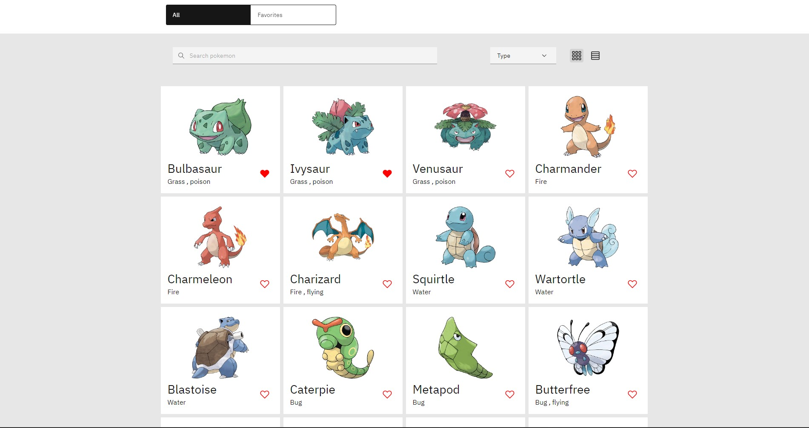
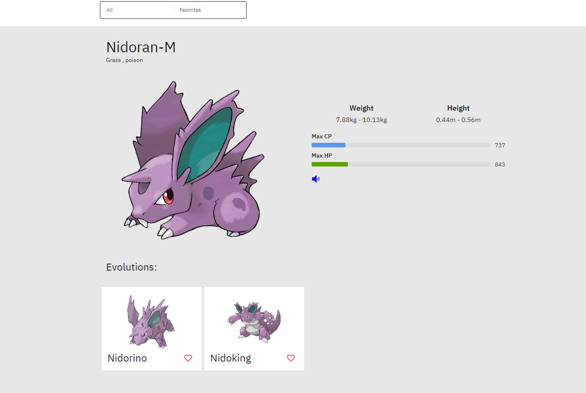

# Coding Exercise Frontend - Pokedex app

List View           |  Detail View
:-------------------------:|:-------------------------:
 |  

Features:

- [x] Search for Pokemon by text through use of a search bar.
- [x] Filter Pokemon by type using a dropdown.
- [x] Add and remove a Pokemon to and from your Favorites by clicking the heart icon.
- [x] Use tabs to switch between `All` Pokemon and `Favorite` Pokemon views.
- [x] Change the view from either a grid or list.
- [x] View Pokemon details using a `/:name` route.
- [x] Clicking on a Pokemon image or name should navigate to the above route to view the Pokemon details.

In addition to the above features, below are some optional features that we'd love to see:
- [x] On the Pokemon details page, have a speaker icon that, when clicked, plays the sound of that Pokemon.
- [x] Infinitely scrolled or paginated list to handle on-demand data-fetching for the long list of Pokemon.
- [ ] Add a quick view button on the Pokemon list items that shows a modal with more information of the Pokemon.
- [ ] Add toast notifications to show success or error messages when adding or removing a Pokemon to and from your Favorites.

### Stack used
- Next js
- Apollo
- scss
- Carbon Design System - my first experience
- Codegen for generating typescript from graphql 
- cypress, jest for testing 

:warning: Backend responses are delayed to simulate server IRL, so that I can play more with caching, loading skeletons ... 

